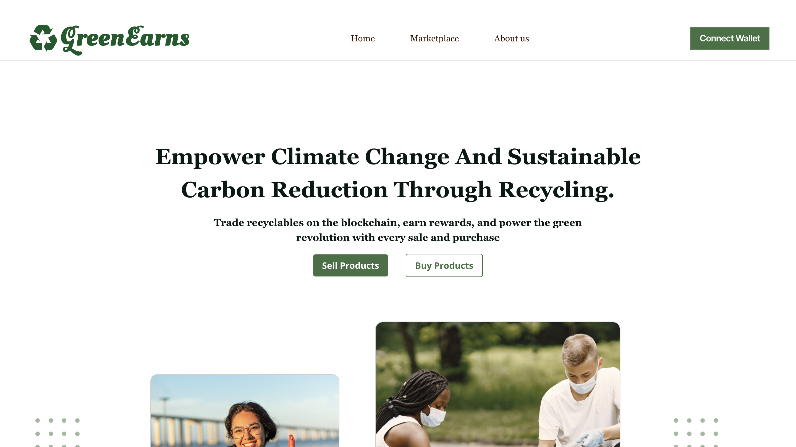
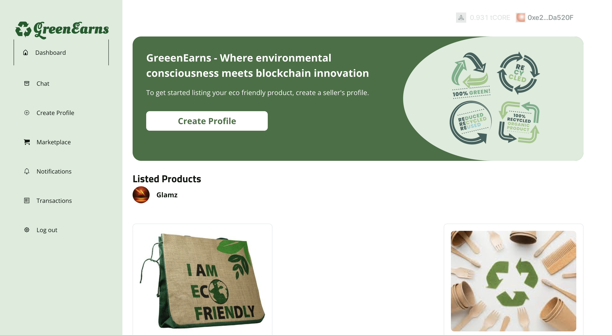

### Greenearns


## Product Overview: 
Greenearns is a decentralized marketplace designed to promote sustainable waste management and recycling by incentivizing individuals, recyclable material sellers, recycling centers, companies, and other eco-conscious buyers to actively participate. Leveraging blockchain technology, Greenearns creates a transparent ecosystem where sellers can list their recyclable materials, and buyers can purchase these materials seamlessly and securely. The platform aims to bridge the gap between buyers seeking eco-friendly products and sellers offering recyclable materials, fostering a sustainable marketplace that benefits both parties while contributing to environmental conservation efforts. The platform rewards participants by enabling secure and transparent transactions using blockchain, ensuring that both sellers and buyers are compensated fairly and securely for their contributions to the recycling ecosystem. In doing so, Greenearns aims to revolutionize the way recyclable materials are bought and sold, encouraging greater participation in recycling efforts and fostering a broader shift toward sustainability.

## Problem Statement:
Efficient waste management and recycling remain a significant global challenge. Finding recyclable materials for purchase and motivating sellers to participate in recycling efforts are persistent issues. There is a lack of transparency and incentives to drive recycling participation effectively.These challenges hinder global progress in reducing waste, mitigating climate change, and achieving carbon reduction goals. Without a clear, fair, and rewarding system in place, participation in recycling efforts remains low.

## Proposed Solution:
Greenearns offers a comprehensive solution by creating a decentralized marketplace specifically for recyclable materials. By using blockchain technology, Greenearns provides an innovative platform that addresses each of the pain points in the recycling supply chain: Decentralized Marketplace for Recyclable Materials: Greenearns connects sellers with buyers, allowing individuals, businesses, and recycling centers to easily list and purchase recyclable materials. This marketplace ensures that buyers have access to a wider array of materials, encouraging the reuse of waste and reducing the need for new resources. Incentives for Participation: Greenearns introduces a rewards system for sellers, motivating them to collect and sell recyclable materials. Through the use of blockchain-based tokens (Green Tokens), sellers are compensated for their efforts, creating a sustainable incentive structure that drives increased participation in recycling. Secure and Transparent Transactions: By leveraging blockchain technology, all transactions on Greenearns are immutable and transparent. This guarantees the authenticity of listed materials, ensures that payments are secure, and builds trust between buyers and sellers. Every transaction is recorded on the blockchain, providing a verifiable trail of recycled materials from their source to their final destination.

## Screenshots

- 1



- 2



## Product Goals:
Facilitate Product Listings and Purchases: Greenearns enables users to easily list recyclable materials and products on the marketplace, providing an accessible and user-friendly interface. Buyers can browse listings, make purchases, and process payments securely through the blockchain network.

Increase Recycling Participation: The platform aims to motivate more sellers to participate by connecting them directly with buyers who are actively seeking recycled materials. This connection fosters a circular economy, where more materials are reused instead of ending up in landfills.

Promote Sustainability: Greenearns is committed to advancing global sustainability efforts by increasing the use of recycled materials in products and encouraging environmentally friendly practices.

Ensure Secure Transactions: The blockchain-based system guarantees secure and transparent payments. By removing intermediaries and allowing direct peer-to-peer transactions, Greenearns ensures that all participants receive fair and timely compensation for their contributions.


## Future Development Plans:
Enhance User Trust within the platform through user ratings, reviews, and transparent transactions. Mobile App development. Implementing the Green Token as incentives for the sellers and buyers to participate in GreenHouse Gas reduction.

## Technical Details

Greenearns is currently deployed on the Ambrosus testnet. This testnet ensures that the platform’s blockchain-based transactions and token rewards system are secure and functional. 

```bash

GreenEarns : https://testnet.airdao.io/explorer/address/0x0C5D7fbB6409a3CA7E446d829D9e186c965e547E/

GreenToken : GreenToken  deployed to 0x6bC09DF5731928F1610baED01003f6eC3db99327

```
These deployments provide the foundation for secure, transparent transactions within the decentralized marketplace.


### Demo Video:

```bash

https://www.youtube.com/watch?v=1WLYIXa3vT0

```


### MVP: 

```bash

https://greenearns-dao.vercel.app/

```

### Pitch Slide: 

```bash

https://www.canva.com/design/DAGYINDKuFU/b-k3CpD3PfIA1dpmjs3cyA/view?utm_content=DAGYINDKuFU&utm_campaign=designshare&utm_medium=link&utm_source=editor


```